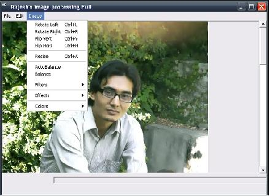



## Nepali photoshop by Rajesh Shrestha

### Description

How to make photoshop in VB, by Mr. Rajesh Shrestha
 
### More Info
 

             |
---                |---
**Submitted On**   |2011-02-26 23:03:20
**By**             |[Rajesh Shrestha ](https://github.com/Planet-Source-Code/PSCIndex/blob/master/ByAuthor/rajesh-shrestha.md)
**Level**          |Advanced
**User Rating**    |4.5 (27 globes from 6 users)
**Compatibility**  |VB 6\.0
**Category**       |[Complete Applications](https://github.com/Planet-Source-Code/PSCIndex/blob/master/ByCategory/complete-applications__1-27.md)
**World**          |[Visual Basic](https://github.com/Planet-Source-Code/PSCIndex/blob/master/ByWorld/visual-basic.md)
**Archive File**   |[Nepali\_pho2198782272011\.zip](https://github.com/Planet-Source-Code/rajesh-shrestha-nepali-photoshop-by-rajesh-shrestha__1-73766/archive/master.zip)

